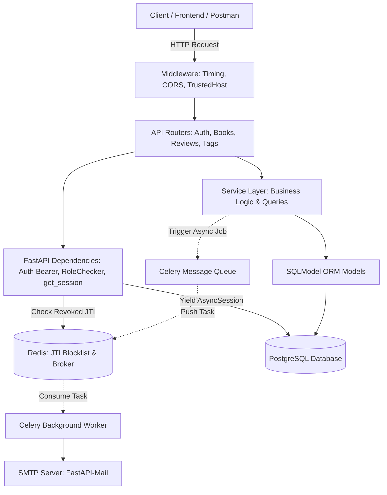

# 🚀 FastAPI Beyond CRUD (Bookly) — Complete End-to-End Deep Dive

---

## 📑 Table of Contents
1. [Executive Summary: Why "Beyond CRUD"?](#1-executive-summary-why-beyond-crud)
2. [High-Level System Architecture & Flowchart](#2-high-level-system-architecture--flowchart)
3. [Folder Structure & Clean Layered Architecture](#3-folder-structure--clean-layered-architecture)
4. [Application Entry & Configuration](#4-application-entry--configuration)
5. [Database Engine & Data Modeling (SQLModel)](#5-database-engine--data-modeling-sqlmodel)
6. [Authentication, Security & RBAC (Deep Dive)](#6-authentication-security--rbac-deep-dive)
7. [Core Business Domains (Books, Reviews, Tags)](#7-core-business-domains-books-reviews-tags)
8. [Asynchronous Background Tasks (Celery + Redis + Mail)](#8-asynchronous-background-tasks-celery--redis--mail)
9. [Centralized Domain Error Handling](#9-centralized-domain-error-handling)
10. [Middleware & Security Headers](#10-middleware--security-headers)
11. [Database Schema Migrations (Alembic)](#11-database-schema-migrations-alembic)
12. [Containerization & Orchestration (Docker & Docker Compose)](#12-containerization--orchestration-docker--docker-compose)
13. [End-to-End Request Lifecycle Walkthrough](#13-end-to-end-request-lifecycle-walkthrough)

---

## 1. Executive Summary: Why "Beyond CRUD"?

Aam tor par beginner tutorials sirf ek table ya JSON file ke upar `Create, Read, Update, Delete` (CRUD) sikhate hain. Real-world production applications mein yeh approach fail ho jati hai kyunki:
* Security aur Authentication ki zaroorat hoti hai (Tokens, Hashing, Roles).
* Database relationships complex hote hain (One-to-Many, Many-to-Many).
* Heavy tasks (e.g. Emails, PDF Generation) API thread ko block kar dete hain.
* Stateless JWTs ko logout karne ka koi native tareeqa nahi hota.
* Schema changes ko bina database delete kiye maintain karna hota hai (Migrations).

**Bookly** project in tamam real-world challenges ko solve karta hai aur industry-standard patterns demonstrate karta hai.

---

## 2. High-Level System Architecture & Flowchart



---

## 3. Folder Structure & Clean Layered Architecture

Project **Clean Separation of Concerns** follow karta hai:

```
beyond-crud/
├── src/
│   ├── __init__.py          # FastAPI app initialization, routes mounting, error & middleware registration
│   ├── config.py            # Pydantic BaseSettings (Reads environment variables)
│   ├── errors.py            # Global custom exception classes & handlers
│   ├── middleware.py        # Request timing logger, CORS & TrustedHost configuration
│   ├── mail.py              # FastAPI-Mail connection setup & message schema
│   ├── celery_tasks.py      # Celery task definitions (e.g., send_email)
│   ├── db/
│   │   ├── main.py          # Async engine, sessionmaker & get_session dependency
│   │   ├── models.py        # SQLModel entities (User, Book, Review, Tag, BookTag)
│   │   └── redis.py         # Async Redis client for token revocation (Blocklist)
│   ├── auth/                # Authentication & Authorization Domain
│   │   ├── routes.py        # Endpoints: /signup, /login, /verify, /logout, /refresh_token, etc.
│   │   ├── service.py       # DB queries for Users (CRUD)
│   │   ├── schemas.py       # Pydantic validation models for auth requests/responses
│   │   ├── utils.py         # Password hashing (bcrypt), JWT generation/decoding, URL tokens
│   │   └── dependencies.py  # AccessTokenBearer, RefreshTokenBearer, RoleChecker
│   ├── books/               # Books Domain (routes, service, schemas)
│   ├── reviews/             # Reviews Domain (routes, service, schemas)
│   ├── tags/                # Tags Domain (routes, service, schemas)
│   └── tests/               # Pytest async unit & integration tests
├── migrations/              # Alembic revision scripts
├── alembic.ini              # Alembic configuration
├── Dockerfile               # Docker container image build instructions
├── compose.yml              # Multi-container orchestration (App, Postgres, Redis, Celery)
└── requirements.txt         # Python package dependencies
```

### Layered Architecture ke 4 Pillars:
1. **`routes.py` (Controller)**: Sirf HTTP requests accept karta hai, validation apply karta hai aur status code ke sath response return karta hai.
2. **`service.py` (Business Logic)**: Database operations aur business rules handle karta hai. Yeh HTTP-agnostic hota hai.
3. **`schemas.py` (Data Transfer Objects / DTO)**: Request body ko validate karta hai aur API responses ka exact shape control karta hai (sensitive fields hide karta hai).
4. **`models.py` (Persistence Layer)**: Database table schema define karta hai.

---

## 4. Application Entry & Configuration

### `src/config.py`:
Configuration manage karne ke liye **`pydantic-settings`** use kiya gaya hai.
* `.env` file se environment variables validate karke load karta hai.
* Type-safe access milta hai: `Config.DATABASE_URL`, `Config.JWT_SECRET`, `Config.REDIS_URL`.
* Celery ke configuration attributes (`broker_url`, `result_backend`) bhi yahin define hain.

### `src/__init__.py`:
Yeh application ka central hub hai:
* FastAPI instance create karta hai versioning ke sath (`/api/v1`).
* Global exception handlers register karta hai (`register_all_errors(app)`).
* Middleware register karta hai (`register_middleware(app)`).
* Har module ke routers ko unke prefixes aur tags ke sath mount karta hai (`book_router`, `auth_router`, `review_router`, `tags_router`).

---

## 5. Database Engine & Data Modeling (SQLModel)

### Async PostgreSQL Connection (`src/db/main.py`)
```python
async_engine = create_async_engine(url=Config.DATABASE_URL, echo=True)

async def get_session() -> AsyncGenerator[AsyncSession, None]:
    async_session = async_sessionmaker(
        bind=async_engine, class_=AsyncSession, expire_on_commit=False
    )
    async with async_session() as session:
        yield session
```
* **Kyun Async?**: Database queries ke doran Python process idle wait nahi karta, balki dusri incoming requests ko serve karta rehta hai (high throughput).
* **Dependency Injection**: `get_session` ek generator hai. FastAPI har request ke liye ek isolated session banata hai aur request complete hone par session cleanly close ho jata hai.

### Data Models & Relationships (`src/db/models.py`)
Project **SQLModel** use karta hai jo SQLAlchemy (ORM) aur Pydantic (validation) ka behtareen combination hai:

1. **User Table (`users`)**:
   * Primary Key: `uid` (UUID4).
   * Password: `password_hash` (`exclude=True` taaki accidental JSON serialization mein leak na ho).
   * Relationships: `books` (1:N) aur `reviews` (1:N).
2. **Book Table (`books`)**:
   * Belongs to User via `user_uid` foreign key.
   * Relationships:
     * `user` (Many Books belong to One User).
     * `reviews` (One Book has Many Reviews).
     * `tags` (Many-to-Many via `BookTag`).
3. **Review Table (`reviews`)**:
   * Fields: `rating` (Constraint: `< 5`), `review_text`.
   * Foreign Keys: `user_uid` aur `book_uid`.
4. **Tag Table (`tags`) & Junction Table (`BookTag`)**:
   * `BookTag` composite primary key (`book_id` + `tag_id`) use karta hai to represent Many-to-Many relationship.

> **💡 The `lazy="selectin"` Architecture**:
> Async SQLAlchemy mein standard lazy loading fail ho jati hai (Greenlet Error). Is project mein `sa_relationship_kwargs={"lazy": "selectin"}` use kiya gaya hai jo related records ko async query ke doran smartly pre-fetch karta hai.

---

## 6. Authentication, Security & RBAC (Deep Dive)

### 1. Password Security (`src/auth/utils.py`)
* `passlib` with `bcrypt` scheme use kiya gaya hai.
* Passwords ko salt aur cost factor ke sath hash kiya jata hai.

### 2. Dual-Token JWT Strategy
* **Access Token**:
  * Expiry: 1 Hour (`ACCESS_TOKEN_EXPIRY = 3600`).
  * Claims: `user` (email, uid, role), `exp`, `jti` (unique token ID), `refresh: False`.
* **Refresh Token**:
  * Expiry: 2 Days (`REFRESH_TOKEN_EXPIRY = 2`).
  * Claims: `refresh: True`.
* **Kyun?** Agar Access Token kisi attacker ke hath lag jaye toh sirf 1 ghante mein expire ho jayega. Refresh token securely stored rehta hai aur naye access tokens generate karta hai.

### 3. JWT Revocation & Redis Blocklist (`src/db/redis.py`)
* **Problem**: JWT stateless hota hai; once issued, server usko database query ke baghair expire nahi kar sakta jab tak uska time khatam na ho.
* **Solution**:
  1. Jab user `/logout` call karta hai, uske token ka `jti` nikaal kar **Redis** mein set kiya jata hai:
     ```python
     await token_blocklist.set(name=jti, value="", ex=JTI_EXPIRY)
     ```
  2. `AccessTokenBearer` dependency har request mein check karti hai:
     ```python
     if await token_in_blocklist(token_data["jti"]):
         raise InvalidToken()
     ```
  3. Result: Logout instant aur 100% secure hota hai!

### 4. Account Verification & Password Reset (`itsdangerous`)
* Cryptographically signed tokens generate hote hain email verification aur password reset ke liye:
  ```python
  serializer = URLSafeTimedSerializer(secret_key=Config.JWT_SECRET, salt="email-configuration")
  ```
* Yeh tokens tamper-proof hote hain aur securely user email ko embed karte hain.

### 5. Role-Based Access Control (RBAC) (`RoleChecker`)
```python
class RoleChecker:
    def __init__(self, allowed_roles: List[str]):
        self.allowed_roles = allowed_roles

    def __call__(self, current_user: User = Depends(get_current_user)):
        if not current_user.is_verified:
            raise AccountNotVerified()
        if current_user.role in self.allowed_roles:
            return True
        raise InsufficientPermission()
```
* Yeh reusable class dependency ban jati hai: `dependencies=[RoleChecker(["admin"])]`.
* Sirf verified users jinka role match karta ho unhi ko access milta hai.

---

## 7. Core Business Domains (Books, Reviews, Tags)

### 📚 Books Domain (`src/books/`)
* **`routes.py`**:
  * `GET /`: Tamam books ki list (Newest first).
  * `GET /user/{user_uid}`: Kisi specific user ki uploaded books.
  * `POST /`: Nayi book create karna (Logged-in user ki UID automatically attach hoti hai).
  * `GET /{book_uid}`: Book details (sath hi uske reviews aur tags bhi return hote hain via `BookDetailModel`).
  * `PATCH /{book_uid}`: Partial updates.
  * `DELETE /{book_uid}`: Book delete karna.
* **`service.py`**: Clean SQLAlchemy queries using `select(Book).order_by(desc(Book.created_at))`.

### ⭐ Reviews Domain (`src/reviews/`)
* **Ownership Enforcement**:
  * Koi bhi user book par review de sakta hai.
  * Lekin review delete karne ke liye check hota hai:
    ```python
    if not review or (review.user != user):
        raise HTTPException(status_code=403, detail="Cannot delete this review")
    ```

### 🏷️ Tags Domain (`src/tags/`)
* Books par tags add/remove karna aur many-to-many associations maintain karna.

---

## 8. Asynchronous Background Tasks (Celery + Redis + Mail)

### The Problem:
SMTP servers se email send karne mein 1 se 3 seconds ka network delay hota hai. Agar yeh code API ke main path mein ho, toh signup request 3 seconds tak latak jayegi.

### The Architecture:
1. **Producer (FastAPI)**:
   ```python
   send_email.delay(emails, subject, html)
   ```
   `.delay()` call hote hi task JSON ban kar **Redis** queue mein push ho jata hai aur API microsecond mein free ho jati hai.
2. **Broker (Redis)**: Task ko safely hold karta hai.
3. **Consumer (Celery Worker)**:
   * Alag process mein chalta hai: `celery -A src.celery_tasks.c_app worker -l info`.
   * Redis se task pick karta hai.
   * `asgiref.sync.async_to_sync` use karke async `FastMail.send_message` ko sync Celery context mein safely execute karta hai.

---

## 9. Centralized Domain Error Handling (`src/errors.py`)

Raw exceptions ya ad-hoc `HTTPException` phenkne ke bajaye, ek clean hierarchy banayi gayi hai:

```
BooklyException (Base)
├── InvalidToken
├── RevokedToken
├── AccessTokenRequired
├── RefreshTokenRequired
├── UserAlreadyExists
├── InvalidCredentials
├── InsufficientPermission
├── BookNotFound
├── TagNotFound
├── TagAlreadyExists
├── UserNotFound
└── AccountNotVerified
```

### Handler Factory:
```python
def create_exception_handler(status_code: int, initial_detail: Any):
    async def exception_handler(request: Request, exc: BooklyException):
        return JSONResponse(content=initial_detail, status_code=status_code)
    return exception_handler
```
Har exception ko standard JSON response format diya gaya hai:
```json
{
  "message": "User with email already exists",
  "error_code": "user_exists"
}
```

---

## 10. Middleware & Security Headers (`src/middleware.py`)

1. **Custom Performance Logger**:
   * Har request ka time track karta hai aur calculate karta hai ke API response mein kitne milliseconds lage:
     ```
     127.0.0.1:51342 - POST - /api/v1/auth/login - 200 completed after 0.082s
     ```
2. **CORS Middleware**:
   * Cross-Origin Resource Sharing allow karta hai taaki frontend clients (React, Angular, Vue) API access kar sakein.
3. **Trusted Host Middleware**:
   * Sirf authorized hosts (`localhost`, `127.0.0.1`, Render domain) ko request allow karta hai, HTTP Host Header attacks ko block karta hai.

---

## 11. Database Schema Migrations (Alembic)

Production databases mein tables ko drop ya rebuild nahi kiya jata. **Alembic** schema changes ko track karta hai:

* `alembic.ini`: Database URL aur migration environment settings.
* `migrations/versions/`:
  * `11d1f79aef4d_add_users.py`: Users table create kiya.
  * `a04d79012711_add_tags_table.py`: Tags aur junction table add kiya.
  * `dba4f311e944_add_review_table.py`: Reviews table add kiya.
* Migrations apply karne ki command:
  ```bash
  alembic upgrade head
  ```

---

## 12. Containerization & Orchestration (Docker & Docker Compose)

`compose.yml` 4 major services ko seamlessly manage karta hai:

1. **`db`**: PostgreSQL container (port `5432`).
2. **`redis`**: Redis in-memory cache/broker container (port `6379`).
3. **`web`**: FastAPI app container (Uvicorn running on port `8000`).
4. **`celery_worker`**: Celery worker process jo background tasks execute karta hai.

Tamam services ek hi Docker network mein communicate karti hain, is liye local setup mein koi manual installation nahi karni padti.

---

## 13. End-to-End Request Lifecycle Walkthrough

Aayein dekhein jab koi client **`POST /api/v1/books/`** request bhejta hai:

1. **Network Hit**: Request port 8000 par aati hai.
2. **TrustedHost Middleware**: Host header check hota hai.
3. **Custom Timing Middleware**: Request timestamp record hota hai.
4. **Routing Engine**: FastAPI path `/api/v1/books/` match karke `book_router` ko call karta hai.
5. **Dependency Execution**:
   - `AccessTokenBearer`: Header se Bearer token uthata hai, verify karta hai, aur Redis blocklist mein check karta hai.
   - `RoleChecker`: Check karta hai ke user verified hai aur allowed role rakhta hai.
   - `get_session`: PostgreSQL ka ek async session provide karta hai.
6. **Request Validation**: Request body `BookCreateModel` schema se validate hoti hai (Title, Author, Published date format).
7. **Controller (`create_a_book`)**: Authenticated user ki `user_uid` aur session ko `book_service.create_book(...)` mein bhejta hai.
8. **Service & Database**:
   - `Book` SQLModel object banta hai.
   - `session.add(new_book)` & `await session.commit()` execute hota hai.
   - Database se naya generated UUID aur timestamps assign hote hain.
9. **Response Serialization**: Naya book record `Book` response schema ke mutabiq serialize hota hai.
10. **Middleware Exit**: Processing duration console par log hoti hai aur client ko `201 Created` JSON response mil jata hai.
